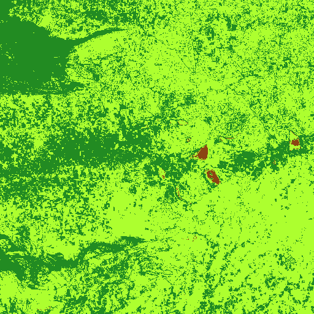

# Sentinel NDVI Flask API (Under Development)

 

This repository contains a Flask API designed to retrieve and serve Normalized Difference Vegetation Index (NDVI) images derived from Sentinel satellite data. It provides endpoints to access NDVI data for specific geographic locations and time ranges.

## Features

* **NDVI Image Retrieval:** Fetches NDVI images based on provided latitude, longitude, and date ranges.
* **Sentinel Satellite Data Processing:** Processes Sentinel satellite imagery to calculate NDVI.
* **Flask API:** Exposes endpoints to access NDVI data via HTTP requests.
* **Geospatial Data Handling:** Uses geospatial libraries to handle coordinate transformations and image processing.
* **Image Serving:** Serves NDVI images as image files (e.g., PNG, GeoTIFF) or as base64 encoded strings.

## Technologies Used

* **Python:** The core programming language.
* **Flask:** For creating the RESTful API.
* **GDAL/rasterio:** For geospatial data processing and image manipulation.
* **NumPy:** For numerical computations.
* **(Add other Python libraries used, e.g., requests, etc.)**
* **Sentinel Satellite Data:** Source of satellite imagery.

## Setup Instructions

1.  **Clone the Repository:**

    ```bash
    git clone [https://github.com/team-av10/sentinel-flask.git](https://www.google.com/search?q=https://github.com/team-av10/sentinel-flask.git)
    cd sentinel-flask
    ```

2.  **Create a Virtual Environment (Recommended):**

    ```bash
    python -m venv venv
    source venv/bin/activate  # On Linux/macOS
    venv\Scripts\activate      # On Windows
    ```

3.  **Install Dependencies:**

    ```bash
    pip install -r requirements.txt
    ```

4.  **Configuration:**

    * Configure any necessary environment variables, such as file paths to Sentinel data or API keys for external services.
    * Ensure that the application has access to the Sentinel satellite data.

5.  **Run the Flask Application:**

    ```bash
    python app.py
    ```

    The API will be accessible at `http://127.0.0.1:5000/` (or the address specified in your Flask configuration).

## API Endpoints

* **`/ndvi?lat=<latitude>&lon=<longitude>&start_date=<YYYY-MM-DD>&end_date=<YYYY-MM-DD>`:**
    * Retrieves the NDVI image for the specified latitude, longitude, and date range.
    * **Parameters:**
        * `lat`: Latitude of the location.
        * `lon`: Longitude of the location.
        * `start_date`: Start date of the time range (YYYY-MM-DD).
        * `end_date`: End date of the time range (YYYY-MM-DD).
    * **Response:**
        * Returns the NDVI image as an image file or a base64 encoded string. The format should be specified in the API documentation or within the response headers.
        * Returns error codes if the request is incorrect, or if there is an error processing the image.

* **(Add any other API endpoints and their descriptions)**

## Usage Example (Python)

```python
import requests

url = "[http://127.0.0.1:5000/ndvi](https://www.google.com/search?q=http://127.0.0.1:5000/ndvi)"
params = {
    "lat": 40.7128,
    "lon": -74.0060,
    "start_date": "2023-01-01",
    "end_date": "2023-01-31",
}

response = requests.get(url, params=params)

if response.status_code == 200:
    # Process the image data from the response
    # For example, save the image to a file:
    with open("ndvi_image.png", "wb") as f:
        f.write(response.content)
    print("NDVI image saved successfully!")
else:
    print(f"Error: {response.status_code}")
    print(response.text)
